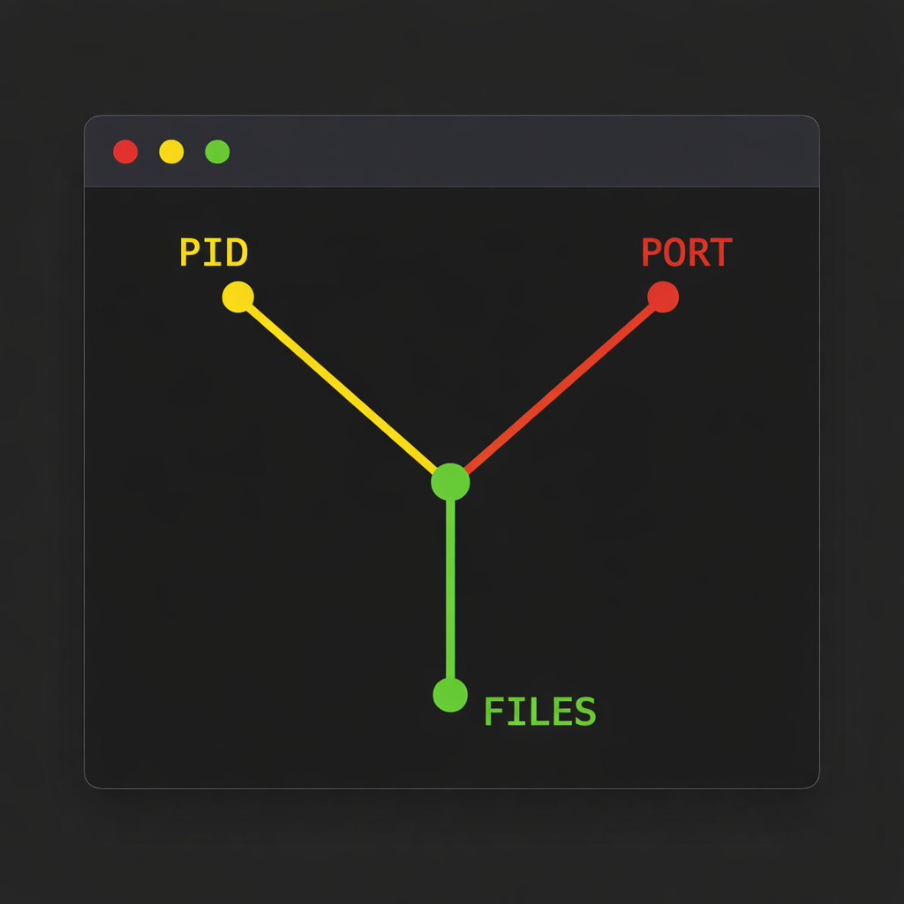
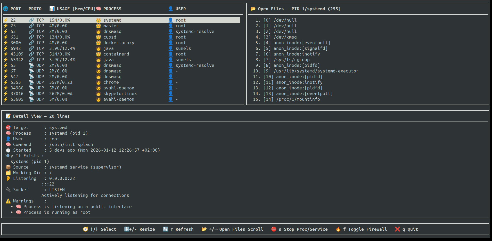
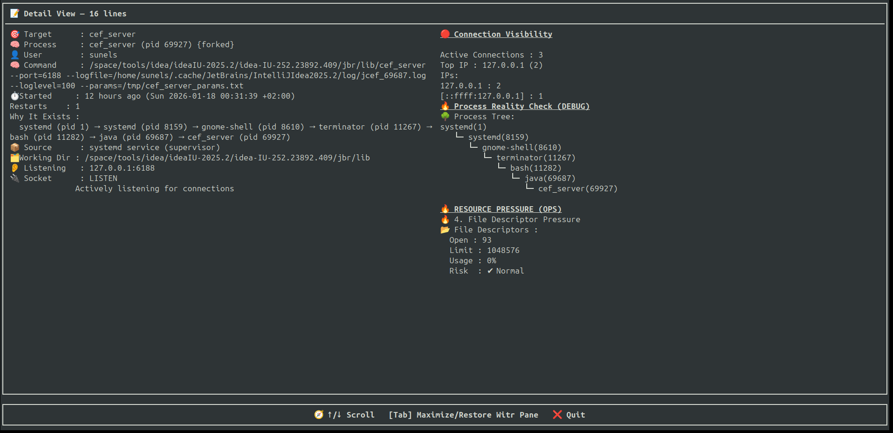

# portwitr-interactive

**Interactive terminal-based port, process, file, and resource inspector for Linux**

`portwitr-interactive` is a high-performance, **curses-based Terminal User Interface (TUI)** designed to give you **instant visibility and control** over your Linux system — all from a single, interactive view.

It enables you to seamlessly navigate the full relationship between:

> **Open ports → owning processes → CPU & memory usage → firewall rules → files in use**

This eliminates the need to jump between multiple tools such as `ss`, `netstat`, `lsof`, `top`, or firewall utilities.

---



---

## Core Navigation

```text
portwitr
├─ 🌐 Ports              View all open ports and their states
├─ ⚡ Usage (CPU/Mem)    Real-time resource consumption per process
├─ 🧠 Processes          Process inspection and ownership mapping
├─ ⛔ Firewall Toggle    Enable/disable firewall rules interactively
└─ 📂 Open Files         Files and sockets used by each process
```
---

## 🧠 What Makes It Special?

Unlike classic tools that show *only one layer* (`ss`, `netstat`, `lsof`),  
**portwitr-interactive connects everything together**:

🔌 **Port** → ⚡ **CPU/MEM Usage** → 🧠 **Process / Service** → ⛔ **Firewall Control** → 📂 **All open files**

---

## 📸 Screenshots

### 🔍 Main View — Ports, Processes & Open Files


---

### 🧾 Detail View — Deep Port & Process Inspection


---


## ✨ Features

- 🔍 **Live port listing** using `ss`
- ⚡ Shows **CPU% / MEM% usage** per process
- 🧠 Maps **PORT → PID → PROGRAM**
- ⛔ **Firewall toggle** for selected port (temporarily block/unblock traffic)
- 📂 Displays **all open files** of the selected process (`/proc/<pid>/fd`)
- 🧾 Deep inspection via **`witr --port`**
- 🖥️ Fully interactive **terminal UI (curses)**
- ⚡ Real-time refresh
- 🛑 Stop a **process or systemd service** directly from the UI (with confirmation)
- 📝 **Warnings annotation** (e.g., suspicious working directory is flagged but explained)

---

## 🎮 Key Bindings

### 🖥️ Main View

| Key | Action |
|-----|--------|
| ↑ / ↓ | Move selection |
| + / - | Resize table height |
| → / ← | Scroll open files |
| r | Refresh port list |
| Tab | Switch to detail view |
| s | Stop selected process / service |
| f | Toggle firewall for selected port |
| q | Quit |

### 📜 Detail View (witr output)

| Key | Action |
|-----|--------|
| ↑ / ↓ | Scroll |
| Tab | Back to main view |
| q | Quit |

---

## 🧠 How It Works

1. **Port discovery**
    - `ss -lntuHp`
2. **Process resolution**
    - Extracts PID & program name from socket metadata
3. **CPU/Mem usage**
    - Uses `ps -p <pid> -o pcpu=,pmem=` for human-readable metrics
4. **Open file inspection**
    - Reads `/proc/<pid>/fd`
5. **Deep context**
    - Calls `witr --port <port>` and annotates warnings
6. **Control**
    - Optional process / service stop via `systemctl` or `kill`
    - Temporary firewall block/unblock via F key

---

## 🧪 Requirements

- 🐧 **Linux only**
- 🐍 Python **3.6+**
- Required system tools:
    - `ss` (iproute2)
    - `systemctl`
    - `/proc` filesystem
    - `witr` (**mandatory**)
    - `ps`
    - `iptables` / `ufw` (for firewall toggle)
- 🔐 `sudo` access required for:
    - `witr`
    - stopping processes/services
    - firewall rule management
    - full `/proc` visibility

---

## 🚀 Installation

```bash
git clone https://github.com/sunels/portwitr-interactive.git
cd portwitr-interactive
python3 portwitr_interactive.py
```

## ⚠️ Safety Notes

- 🛑 Destructive actions always require confirmation
- 🧠 PID `1` (systemd) is protected
- ⚡ Firewall toggle only affects traffic temporarily, does **not stop process**
- 👀 Non-root usage limits visibility (expected behavior)
- 📝 Warnings (like suspicious working directory) are annotated with explanation

---

## 🧩 Design Philosophy

- ❌ No reinvention of system tools
- ✅ Built on **native Linux introspection**
- 🔍 Read-only by default (except explicit stop/firewall actions)
- 🎯 Optimized for:
    - “Port already in use” debugging
    - Security inspection
    - DevOps / SRE diagnostics
    - Understanding legacy systems

---

## 📁 Project Structure
```bash
portwitr-interactive/
├── portwitr_interactive.py
├── README.md
├── pp-1.png
└── pp-2.png
```

## 🛣️ Roadmap (Ideas)

- 🔎 Port search & filters
- 📤 JSON export
- 🧪 Parser unit tests
- 🍎 Partial macOS support
- 🔌 Plugin system

---

## 📄 License

MIT License

---

## 👤 Author

**Serkan Sunel**

---

> 🔌 **portwitr-interactive**  
> *See the whole picture — not just the port.*
